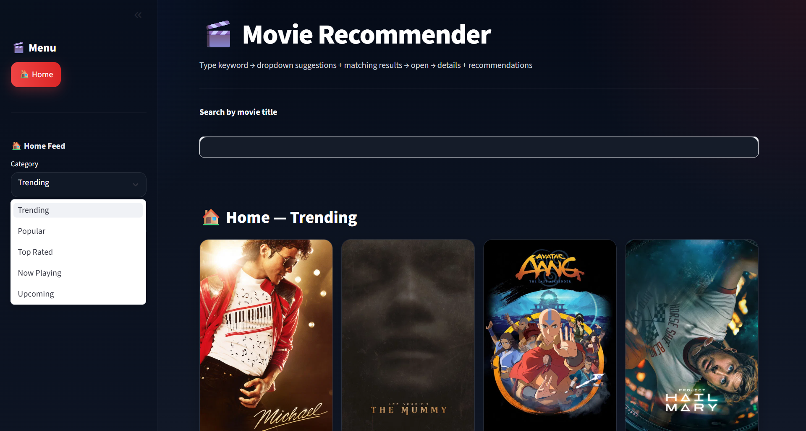
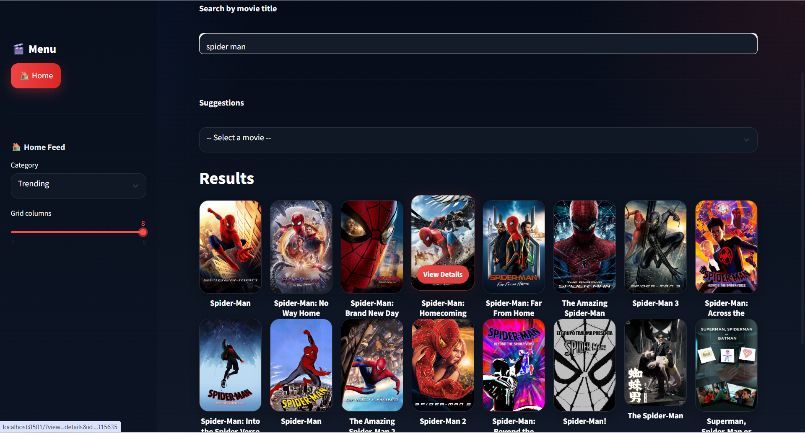
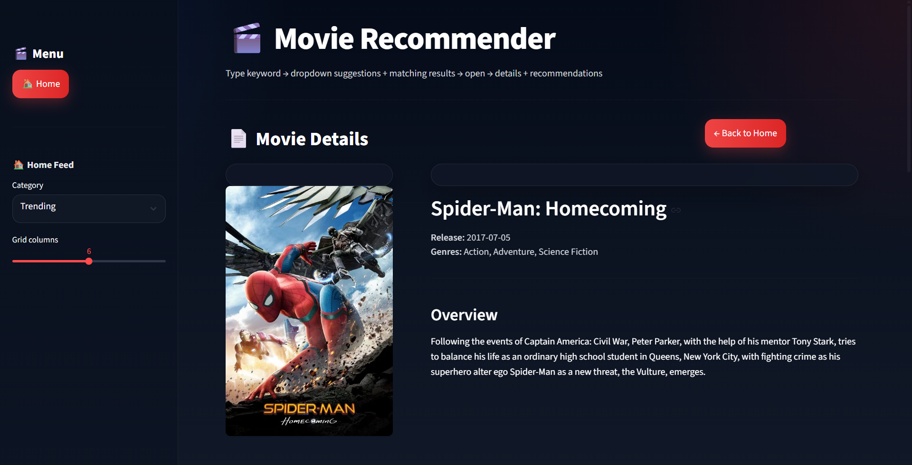
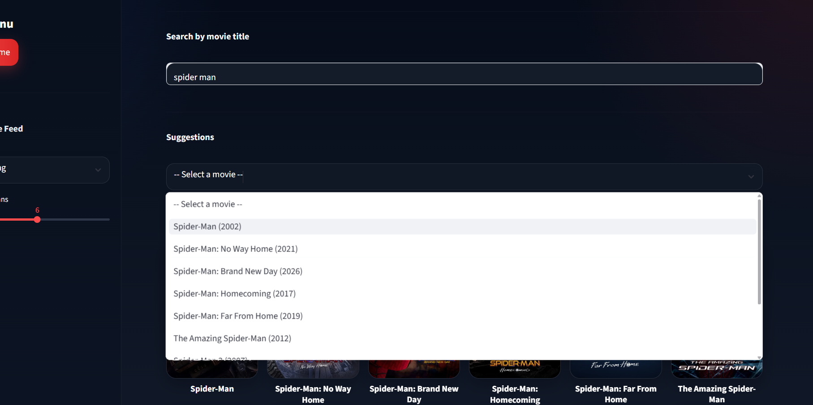

# Movie Recommender System :

A content-based movie recommendation system built using Machine Learning and Streamlit, enhanced with TMDB API for real-time search, posters, movie details, and additional recommendations.

## Overview :

This project recommends movies by analyzing the similarity between movie metadata such as overview, genres, keywords, cast, and crew.  
The recommendation pipeline is powered by a preprocessed movie dataset stored in `movie_dict.pkl` and a precomputed similarity matrix stored in `similarity.pkl`, while the Streamlit frontend provides an interactive and visually appealing user experience.

##  Features :

- Live movie search with suggestions  
- Content-based movie recommendations  
- Genre-based fallback recommendations  
- Movie posters and backdrops using TMDB API  
- Clickable movie cards with hover effects  
- Premium dark Netflix-style UI  
- Fast recommendation retrieval using precomputed similarity scores  

##  How the Recommendation System Works :

The main recommendation model is based on **content-based filtering**.

### 1. Data Preprocessing :

The movie metadata was cleaned and transformed using the following important fields:
- overview  
- genres  
- keywords  
- cast  
- crew  

These fields were combined into a single feature column called `tags`.

### 2. Feature Engineering :

The `tags` column was created by merging important textual information for each movie into one string representation. This allowed the recommendation system to compare movies based on their content.

### 3. Text Vectorization :

To convert movie text into numerical form, **CountVectorizer** from Scikit-learn was used.

CountVectorizer transformed the `tags` column into vectors based on the most important words appearing across the dataset.

### 4. Similarity Computation :

After vectorization, **Cosine Similarity** was applied to measure how similar one movie is to another.

This produced a similarity matrix where:
- each row represents one movie
- each column represents similarity score with another movie

That similarity matrix was saved as:

`similarity.pkl`

### 5. Processed Movie Data :

The cleaned movie information containing:
- `movie_id`
- `title`
- `tags`

was stored in:

`movie_dict.pkl`

This file acts as the main processed dataset used by the recommender at runtime.

## Main Model Files :

### Movie Recommendation System.ipynb  
This notebook contains the complete Machine Learning pipeline used to build the recommendation system. It includes:
- Data preprocessing and cleaning  
- Feature engineering (creation of tags)  
- Text vectorization using CountVectorizer  
- Cosine similarity computation  
- Generation and saving of model files (`movie_dict.pkl` and `similarity.pkl`)  

### movie_dict.pkl
This file contains the processed movie dataset after cleaning and feature engineering.  
It stores movie titles, IDs, and tags used for generating recommendations.

### similarity.pkl
This file contains the precomputed cosine similarity matrix.  
It allows the system to quickly find similar movies without recalculating similarity during runtime.

### app.py
This is the main Streamlit application file.  
It handles:
- frontend UI  
- movie search and suggestions  
- recommendation display  
- TMDB API integration  
- navigation between pages  

## Tech Stack :

- Python  
- Pandas  
- Scikit-learn  
- Streamlit  
- Requests  
- TMDB API  

## Libraries Used :

- `pandas` for data manipulation  
- `pickle` for loading saved model files  
- `scikit-learn` for CountVectorizer and cosine similarity  
- `streamlit` for building the web app  
- `requests` for API communication  

## Project Structure :

Movie-Recommender/

├── app.py                         # Main Streamlit web application  
├── movie_dict.pkl                 # Processed movie data  
├── similarity.pkl                 # Precomputed similarity matrix  

├── Movie Recommendation System.ipynb   # ML model building notebook  

└── .streamlit/  
    └── secrets.toml              # TMDB API key  

## Setup Instructions :

### 1. Install dependencies :

Run the Following in The Terminal : 
pip install streamlit pandas scikit-learn requests

### 2. Add TMDB API Key :

Create this file:

.streamlit/secrets.toml

TMDB_API_KEY = "your_api_key"

Add your API key inside it:

### 3. Run the application
streamlit run app.py

# Output : 

- Recommends similar movies based on content similarity
- Uses TMDB API to improve real-world search and visuals
- Displays posters, backdrops, and movie details in an interactive UI

# Note :

- The recommendation model is based on the processed movie dataset used during training
- Newer movies may not always appear in ML recommendations if they were not part of the original dataset
- TMDB API is used to improve user experience through live search and visuals

## Challenges Faced :

- Handling missing or incorrect movie posters from TMDB API  
- Managing mismatch between dataset movies and real-time TMDB search results  
- Ensuring smooth navigation between pages using Streamlit session state  
- Improving UI visibility and removing default Streamlit layout issues (extra spacing, low contrast text)  
- Making movie cards clickable without using traditional buttons  
- Optimizing recommendation speed using precomputed similarity matrix  
- Dealing with limitations of the dataset (older movies, missing latest releases)  

## 📸 Screenshots

### 🏠 Home Page

### 🔍 Search Results

### 📄 Movie Details

### 🎯 Recommendations

